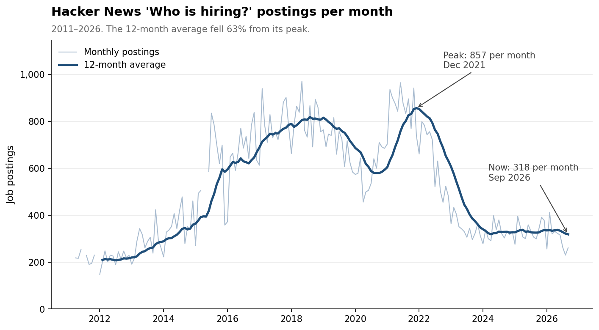
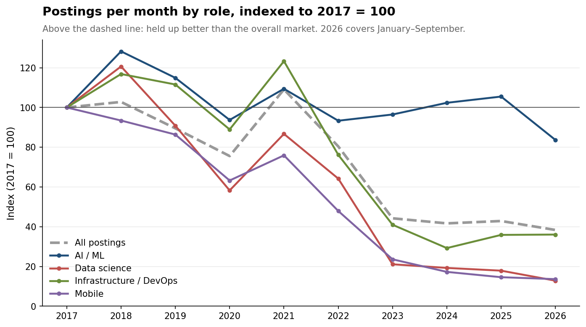
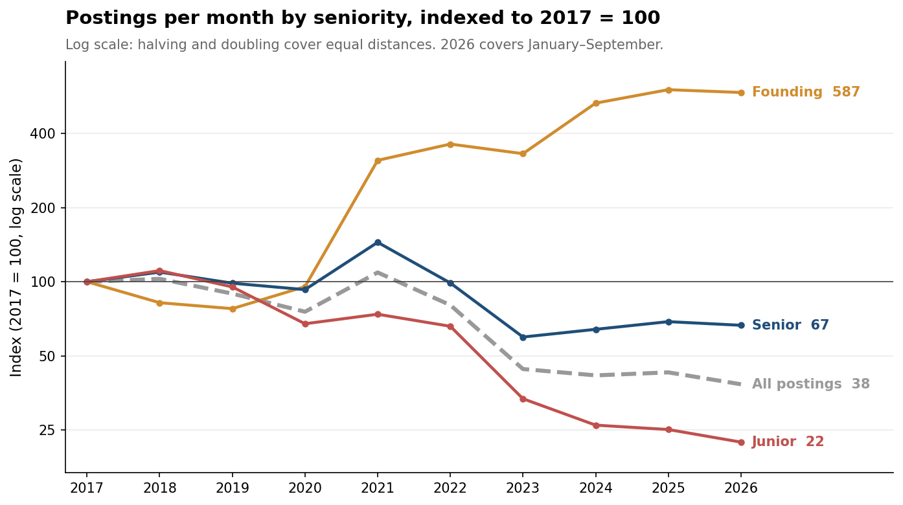
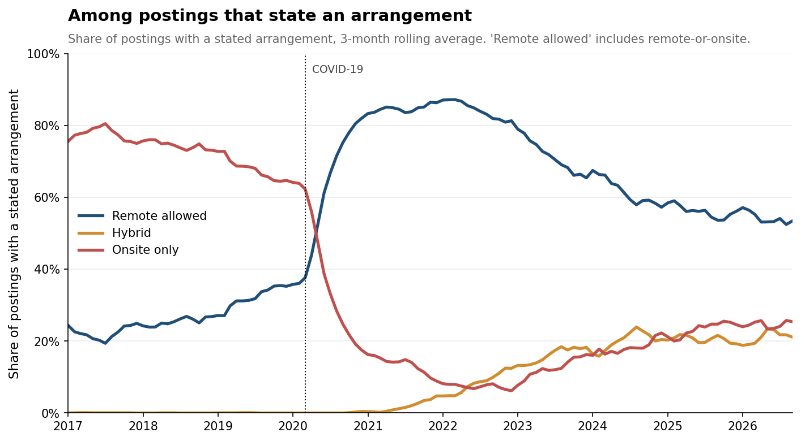
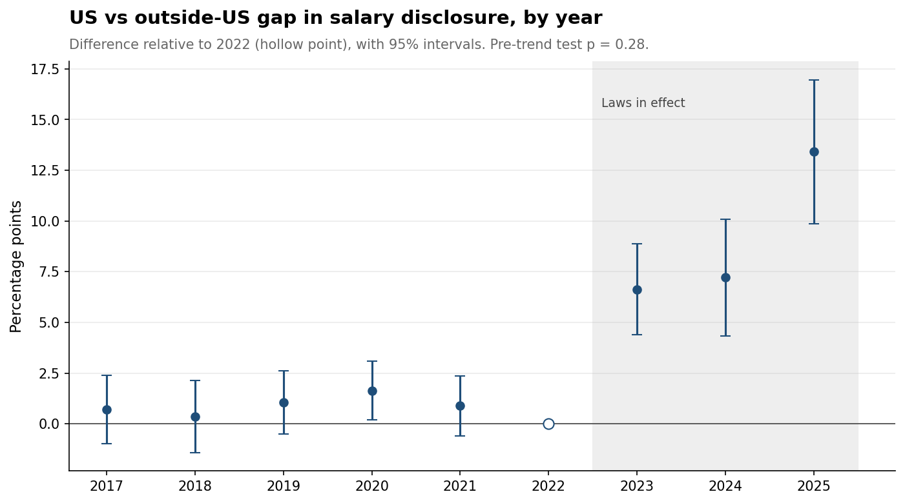

# Who Is Hiring? 15 Years of Hacker News Job Postings

A data pipeline and analysis of every monthly "Ask HN: Who is hiring?" thread
from April 2011 to September 2026: 93,122 job postings from 183 threads,
collected through a public API, parsed into a structured dataset, and analyzed
for trends in hiring volume, roles, seniority, remote work, geography and pay.

## Overview

Every month since 2011, Hacker News has hosted a thread where companies post
open roles, one comment per company. Nobody publishes these as structured data:
postings are free text, and the conventions for writing them changed over 15
years. This project builds that dataset and uses it to describe how tech hiring
changed through the 2021 boom, the contraction that followed, the shift to
remote work, the rise of AI, and the arrival of pay-transparency laws.

**Key findings** (2025 is the last full year):

1. **Hiring fell 63% from its peak and has stabilized.** Postings peaked at 857
   per month in December 2021 and fell to 318; since 2024 volume has held near
   330 per month, roughly the 2014 level.
2. **AI/ML was the one role that held up.** In 2025 AI/ML postings were at 105%
   of their 2017 level while all postings were at 43%. Data science fell to 18%.
3. **Entry-level hiring fell hardest.** Junior postings fell to 25% of their
   2017 level, and the 2021 boom largely skipped them. Founding-engineer
   postings grew about sixfold.
4. **Remote work retreated but did not reverse.** Remote-allowed postings rose
   from 22% of stated arrangements in 2017 to about 87% in early 2022, then fell
   to 56%, still well above pre-pandemic levels.
5. **New York gained on every other metro.** Its share of postings naming a
   major US metro rose from 24% to 39%, while the Bay Area held near 56%.
6. **Pay-transparency laws roughly doubled salary disclosure.** A
   difference-in-differences estimate finds US disclosure rose 8.3 percentage
   points more than disclosure outside the US after 2023 (95% CI: 6.4 to 10.2),
   from a 6.7% baseline.
7. **Disclosed pay rose 22% in real terms**, while the premium for senior
   titles shrank from about $21,000 to about $2,000.

## Data sources

- **Hacker News**, via the [Algolia HN Search API](https://hn.algolia.com/api).
  All threads are posted by the `whoishiring` account. The API is public and
  requires no authentication. This project uses the API rather than scraping
  HTML pages.
- **Consumer Price Index (CPI-U)**, series
  [CPIAUCSL](https://fred.stlouisfed.org/series/CPIAUCSL) from FRED, used to
  express salaries in 2025 dollars.

**Privacy.** 95% of postings contain a recruiter email, link or phone number.
These are removed before any data is saved to `data/processed/`. The raw
comment text is kept locally and never committed.

## Methodology

**Collection.** Thread IDs come from the `whoishiring` account's submissions,
filtered to titles matching the monthly `(Month Year)` pattern, which excludes
one-off threads. 118,736 comments were downloaded. The Algolia search endpoint
silently caps any query at 1,000 results, which truncated the largest threads
in an early version; comments are therefore collected by walking backwards
through timestamps, where each request is a fresh query and the cap never binds.

**Parsing.** Only top-level comments are job postings. 66 comments using the
"Who wants to be hired?" candidate template were removed. Postings
conventionally open with a header like `Company | Role | Location | ...`, but
this format was rare before 2015 and near-universal only from 2017, so all
field-level analysis starts in 2017. Posting volume, which needs no parsing,
uses the full period.

Roles, seniority, work arrangement and location are extracted with keyword
patterns from the header only, since body text mentions terms like "remote"
incidentally. Roles are grouped into families (e.g. AI/ML) because titles drift
over time. Salary ranges are matched as a single unit so both ends survive;
retirement plans ("401k"), funding figures ("$50M Series B") and monthly or
hourly rates are excluded, and currency is read from the text immediately
around each figure.

**Analysis.** Because total volume fell sharply after 2021, nearly every
category's raw count falls too. Categories are therefore compared against the
overall market, as an index or a share, so the contraction is not mistaken for
a change in demand. Where a denominator would mechanically distort a result,
it is restricted: metro shares use only postings that name a metro, because
remote postings usually name none.

**Causal estimate.** The effect of pay-transparency laws is estimated with a
difference-in-differences design on 46,364 postings. US-only postings are the
treated group and postings located only outside the US, which the laws do not
cover, are the comparison group. The outcome is whether a posting discloses a
salary, with year fixed effects. An event study tests whether the two groups
moved together before the laws took effect.

## Results

### Hiring volume



The 12-month average peaked at 857 postings per month in December 2021 and
fell 63% to 318. 2023 was the sharpest year, down 45%. The decline stopped in
2024: volume has held near 330 per month since, roughly its 2014 level. The
2021 peak was a rebound from a 2019–2020 dip rather than the top of a steady
climb.

### Roles



Until 2022 AI/ML postings rose and fell with the rest of the market. From 2023
they stopped falling, reaching 105% of their 2017 level in 2025 while overall
postings stood at 43%. Their share of postings roughly doubled, almost entirely
because everything else shrank around them. Data science tracked the market
until 2022, then fell 67% in a single year; this data cannot distinguish data
science jobs disappearing from being retitled. Mobile's decline was steady and
unrelated to any market shock.

### Seniority



Junior postings fell to 25% of their 2017 level against 43% for the market,
and began underperforming in 2020, before the contraction. In the 2021 boom,
senior postings rose to 145% of their 2017 level while junior postings reached
only 74%. Founding-engineer postings grew about sixfold in two stages: first in
2021, with the peak in startup funding, and again in 2024, with the AI startup
wave. Part of that growth reflects the title becoming fashionable.

### Remote work



Among postings stating an arrangement, remote-allowed rose from 22% in 2017 to
33% in 2019, so COVID accelerated an existing trend. Onsite-only postings fell
from about 62% to 16% within 2020. Remote-allowed peaked near 87% in early 2022
and fell to 56% by 2025, starting about when hiring contracted. Remote postings
fell 75% from 2021 to 2025, faster than the market's 61%, so the decline
reflects fewer remote jobs rather than only more onsite ones. "Hybrid" is
essentially absent before 2021 and reached 18% of postings.

### Geography

Among postings naming a major US metro, the Bay Area's share held near 56%
throughout, with only a brief dip in 2021–2022. New York's rose steadily from
24% to 39%, beginning before 2020; it is the only metro whose postings fell
less than the overall market. Austin, Boston and Seattle all peaked in 2022 and
fell back afterward, as hiring reconcentrated in the two largest hubs.

### Pay transparency and pay



From 2017 to 2022, the share of postings disclosing a salary moved together
inside and outside the US. From 2023, when laws took effect in New York City,
California and Washington, US postings pulled ahead. The difference-in-
differences estimate is **+8.3 percentage points** (95% CI: 6.4 to 10.2), more
than doubling a 6.7% baseline. Pre-period gaps stay between 0.4 and 1.6 points
(joint test p = 0.28), and the effect grew each year to 13.4 points in 2025.

An earlier design comparing New York with other US postings found no effect.
That was the wrong comparison: employers hiring in several states use one job
description, so a law in one large market changes postings nationwide.

Median disclosed salaries in US postings rose from $115,000 to $185,000 nominal,
or from $150,000 to $183,000 in 2025 dollars. Senior postings grew from 19% to
41% of disclosed salaries, but the gap between senior and non-senior pay shrank
from about $21,000 to about $2,000, consistent with "senior" spreading to less
senior roles. Salaries could not be analyzed by specific role: data science,
data engineering, data analyst and junior postings each have fewer than 30
disclosed US salaries in most years.

## Repository structure

```
hn-hiring-tracker/
├── README.md
├── requirements.txt
├── src/
│   ├── collect_threads.py      # find the 183 monthly thread IDs
│   ├── collect_comments.py     # download all comments to data/raw/
│   ├── parse_postings.py       # raw comments → postings.parquet
│   ├── text_utils.py           # HTML cleaning and contact redaction
│   ├── locations.py            # location keyword patterns
│   ├── roles.py                # role and seniority keyword patterns
│   ├── survey_format.py        # diagnostic: header format by year
│   └── inspect_parsing.py      # diagnostic: sample parsed postings
├── notebooks/
│   └── analysis.ipynb          # all analysis and charts
├── data/
│   ├── raw/                    # unredacted comments (gitignored)
│   ├── processed/
│   │   ├── threads.csv
│   │   ├── thread_comment_counts.csv
│   │   └── postings.parquet    # redacted, one row per posting
│   └── external/
│       └── cpi_u.csv
└── figures/                    # charts saved by the notebook
```

## Getting started

The processed dataset is committed, so the notebook runs without re-collecting
anything.

```bash
git clone https://github.com/AirKristo/hn-hiring-tracker.git
cd hn-hiring-tracker
python -m venv .venv
source .venv/bin/activate
pip install -r requirements.txt
```

To run the analysis, open `notebooks/analysis.ipynb` and run all cells.

To rebuild the dataset from scratch, run from the repository root:

```bash
python src/collect_threads.py     # about a minute
python src/collect_comments.py    # about 10–12 minutes; resumable
python src/parse_postings.py      # about a minute
```

`collect_comments.py` skips threads already downloaded, so it can be re-run to
add new months.

## Limitations

- **HN is not the labor market.** Postings skew toward startups and engineering
  roles, and employers choose whether to post. Volume reflects both hiring
  demand and the thread's popularity, so it is best read as a relative index.
- **Titles drift.** Some trends partly reflect vocabulary rather than jobs:
  data science versus AI/ML, "founding engineer", "hybrid", and the spread of
  "senior".
- **Keyword matching has limited recall.** Roles are found in about 60% of
  postings, so role shares are lower bounds. Coverage is stable from 2017
  onward, so trends are not artifacts of changing extraction rates.
- **Disclosed salaries are a selected sample.** As disclosure spread, the mix
  of employers behind the salary figures changed.
- **The causal estimate rests on two groups.** Standard errors cannot be
  clustered by group, so they are clustered by monthly thread and are likely
  too narrow; the conclusion holds even if they are doubled. Postings outside
  the US are an imperfect comparison group, and a US-specific norm shift
  coinciding with the laws would produce the same pattern.
- **2026 is a partial year** (January to September).

## References

- Algolia HN Search API: https://hn.algolia.com/api
- U.S. Bureau of Labor Statistics, Consumer Price Index for All Urban
  Consumers (CPIAUCSL), retrieved from FRED, Federal Reserve Bank of St. Louis:
  https://fred.stlouisfed.org/series/CPIAUCSL
- New York City Local Law 32 of 2022 (salary transparency in job postings),
  effective November 1, 2022
- California SB 1162, effective January 1, 2023
- Washington SB 5761, effective January 1, 2023
- Colorado Equal Pay for Equal Work Act, effective January 1, 2021
- Directive (EU) 2023/970 on pay transparency, adopted 2023, to be transposed
  by June 2026